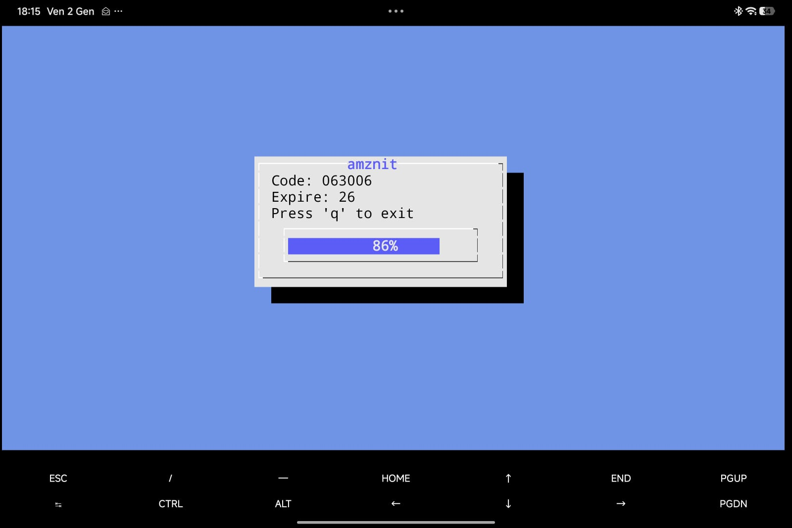
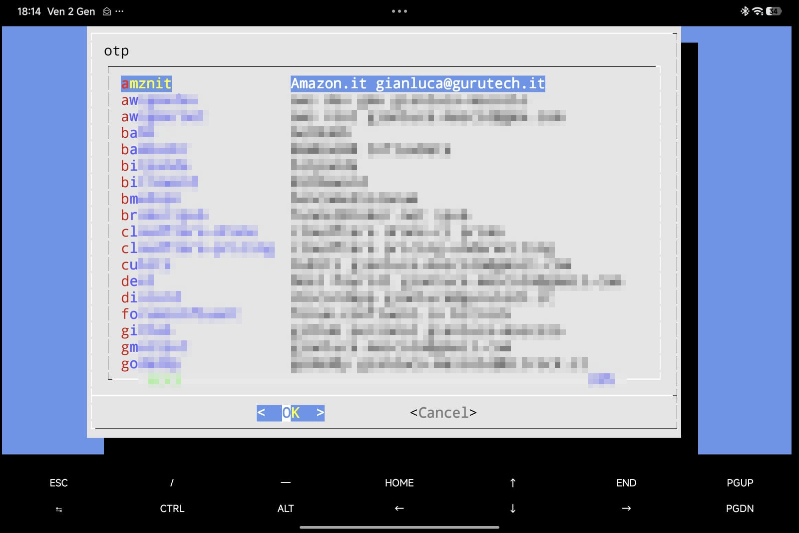

# OTP TUI - Terminal User Interface for otpgui

This directory contains example scripts that provide a terminal-based interface for generating OTP codes using `dialog`. This is useful for headless servers, SSH sessions, or environments without a graphical display.

## Prerequisites

- `otpgui` installed and available in PATH
- `dialog` - terminal dialog boxes
- `yq` - YAML processor
- `jq` - JSON processor

## How It Works

These scripts leverage `otpgui`'s scripted mode (`-i script`) which outputs OTP data in a shell-parseable format:

```
OTP_CODE=123456
OTP_TIMEOUT=25
```

This allows integration with any shell script or terminal UI.

## Scripts

### otptui.sh

Displays a single OTP code with a live countdown timer.

**Usage:**
```bash
./otptui.sh <OTP_LABEL>
```

**Example:**
```bash
./otptui.sh github
```

The script shows:
- The current OTP code
- Seconds until expiration
- A progress bar indicating time remaining

Press `q` to exit.



### otpmenu.sh

An interactive menu to select an OTP account, then launches `otptui.sh` to display the code.

**Usage:**
```bash
./otpmenu.sh
```

The script:
1. Reads OTP labels from your configuration file
2. Presents a scrollable menu using `dialog`
3. Launches `otptui.sh` with the selected account



## Configuration

`otpmenu.sh` automatically reads the OTP configuration path from `otpgui`'s settings file (`${XDG_CONFIG_HOME:-$HOME/.config}/otpgui/settings.yml`). No manual configuration is needed if `otpgui` is already set up.

## Integration with otpgui

These scripts demonstrate how `otpgui -i script` can be used to build custom interfaces. The scripted mode outputs variables that can be evaluated in shell:

```bash
eval $(otpgui -i script -l mylabel)
echo "Code: $OTP_CODE (expires in $OTP_TIMEOUT seconds)"
```

This makes it possible to integrate OTP generation into any workflow or automation.
